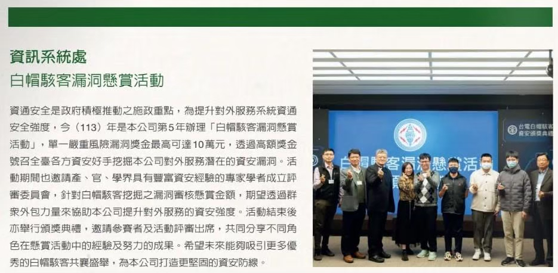
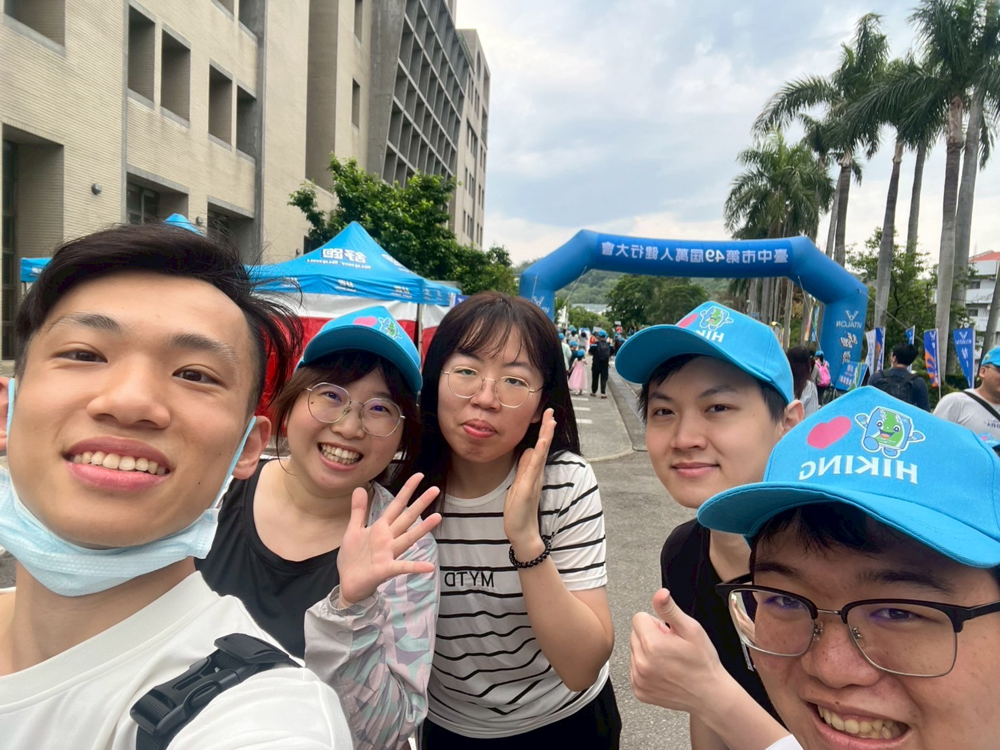
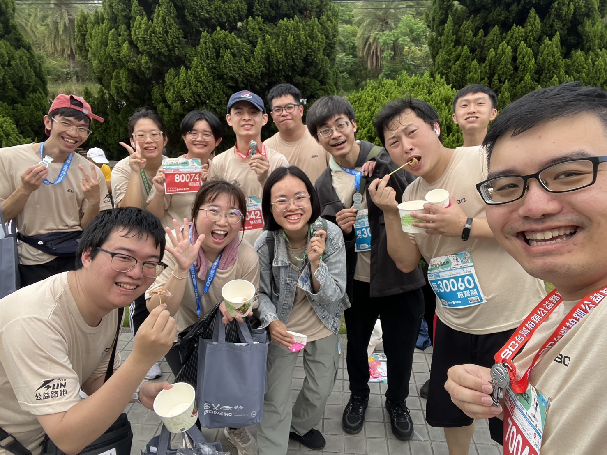
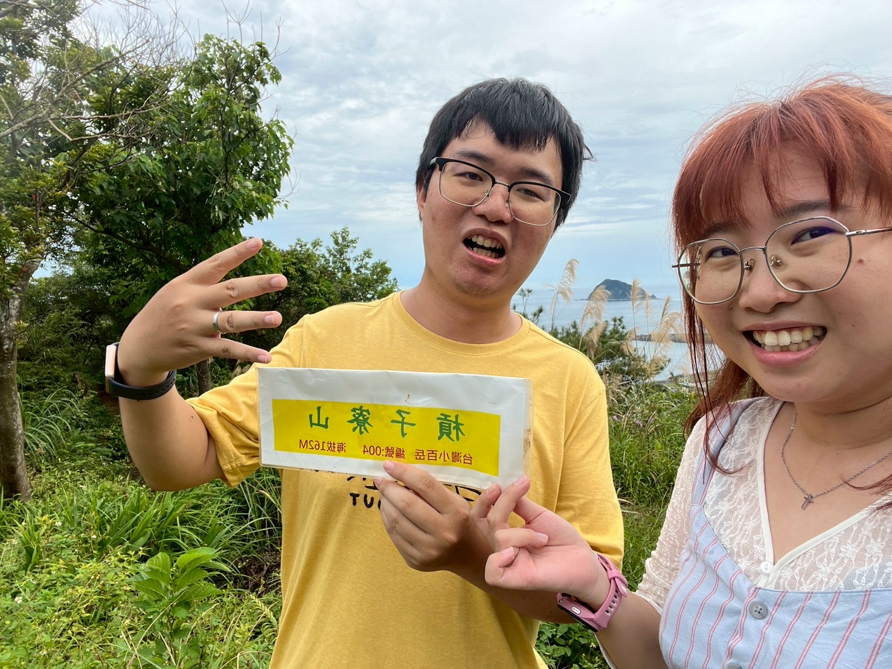

# 100 件待完成的夢想

- [x] 1. 出國 - 2023 日本五天四夜
- [ ] 2. 買一間套房
- [x] 3. 考到資安證照 - 2023 iPAS 資訊安全工程師中級認證
- [ ] 4. 經營一個鋼琴教學的頻道
- [ ] 5. 經營一個資安教學的頻道
- [ ] 6. 成為交易平台上的 master trader
- [x] 7. 穩定工作滿一年 - 2023.03, 2024.03, 2025.03 松和工業
- [ ] 8. 成立一家商行
- [ ] 9. 成立一家公司
- [x] 10. 參觀水族館 - 2023 Xpark
- [ ] 11. 低成本養殖漁業
- [ ] 12. 水耕菜園
- [ ] 13. 被動收入 > 年支出
- [ ] 14. 學會平衡車
- [ ] 15. 堅持游泳一個月
- [ ] 16. 日文 N2
- [x] 17. 參加頒獎典禮 - 2024/01/11 台電白帽駭客懸賞活動、2024/12/13 台電
- [x] 18. 夜景餐廳 - 2024 東星屋
- [x] 19. 網紅見面會 - 2023 搞神馬義賣活動
- [ ] 20. 鋼琴調音師
- [ ] 21. 資產達到一百萬美金 - 達成率 0.3%
- [x] 22. 去一趟侏羅紀公園 - 2023 日本環球影城
- [x] 23. 結婚 - 2023 訂婚結婚 2024 辦婚禮
- [ ] 24. 台語歌唱表演
- [ ] 25. 幫助別人完成夢想
- [ ] 26. 一趟欣賞極光之旅
- [x] 27. 國際巡迴演出 - 2023 鐵達尼號電影音樂會
- [ ] 28. 出版一本書
- [x] 29. 搭乘郵輪 - 2025 MSC 榮耀號 日本沖繩
- [x] 30. 去動物園 - 2024 頑皮世界
- [x] 31. 養寵物 - 2023 復興、啾啾、碰啾、阿鳥
- [ ] 32. 建立秋草鸚鵡鳥舍
- [ ] 33. 堅持超慢跑一個月
- [ ] 34. 買有公設的公寓
- [ ] 35. 公共場合演奏柯南
- [x] 36. 營火晚會 - 2024 凱歌夏令營
- [x] 37. 運作工程軟體組 - 2024
- [x] 38. 帶家人出去玩 - 2023/11/11 媽媽去魚市場
- [x] 39. 去寵物友善餐廳 - 2024 阿鳥養鍋
- [ ] 40. 整理小提琴一百首
- [ ] 41. 按部就班把聖經讀完
- [ ] 42. 對三個開源專案有貢獻
- [ ] 43. 參加數獨比賽
- [x] 44. 馬拉松 - 2025 5K 台中大雅、2025 7K 台中大坑
- [x] 45. 露營 - 2025.04 親子愛露營
- [x] 46. 小百岳 - 2025.05 頭嵙山
- [ ] 47. 開發區塊鏈應用
- [x] 48. 參加跳舞班 - 2025 週四跳舞班

---

## 1. 出國旅遊
|年度|國家|地區|
|----|----|----|
|2019|中國|桂林|
|2023|日本|京都、大阪|
|2025|日本|沖繩|

---

## 10. 參觀水族館

#### 2023 Xpark

---

## 17. 參加頒獎典禮

#### 2024/01/11 台電白帽駭客懸賞活動

---

## 21. 投資
移至 private repo [awchjimmy/21-portfolio](https://github.com/awchjimmy/21-portfolio)

---

## 29. 搭乘郵輪

#### 2025 MSC 榮耀號

---

## 41. 讀完聖經

1. 創世記 2025/07/25
2. 出埃及記 2025/07/31
3. 利未記 2025/08/05
4. 民數記 2025/08/11
5. 申命記 2025/08/14
6. 約書亞記 2025/08/19
7. 士師記 2025/08/21
8. 路得記 2025/08/21
9. 撒母耳記上 2025/08/26
10. 撒母耳記下 2025/08/27
11. 列王紀上 2025/09/03
12. 列王紀下 2025/09/05
13. 歷代志上 2025/09/11
14. 歷代志下

---

## 44. 馬拉松

#### 2025.02.23 晨曦麥香-昂首舞勺馬拉松 5K

#### 2025.04.12 萬人健行大會 7K

#### 2025.04.19 台灣柏釧公益路跑 10K

## 46. 小百岳

#### #4 槓子寮山 H162M
2025.07.11，基隆行吐到不行

#### #41 頭嵙山 H859M
2025.05.01，大坑 5 號步道，5 上 5 下。

#### #43 三汀山 H480M
2025.06.15，三汀山遇到電影主角古大哥

